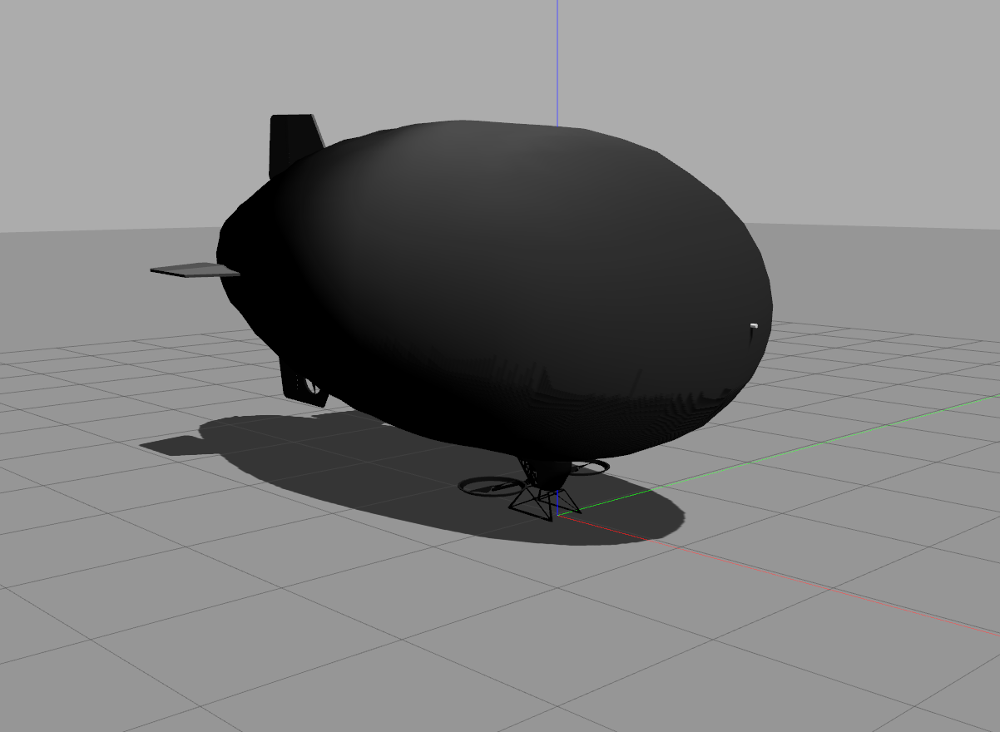

# Autonomous Blimp Control using Deep Reinforcement Learning
=================================================================

## For more information, read our preprint on arXiv: https://arxiv.org/abs/2109.10719
--------------------------------------------------------------

# Copyright and License

All Code in this repository - unless otherwise stated in local license or code headers is

Copyright 2021 Max Planck Institute for Intelligent Systems

Licensed under the terms of the GNU General Public Licence (GPL) v3 or higher.
See: https://www.gnu.org/licenses/gpl-3.0.en.html


# Contents

* /RL -- RL agent related files.
* /blimp_env -- training environment of the RL agent. 
* /path_planner -- waypoints assignment.

# Install blimp simulator
See: https://github.com/robot-perception-group/airship_simulation. 

Note: The default ROS version for the blimp simulator is melodic, you should switch to noetic branch.

## Configure software-in-the-loop firmware
This step enables ROS control on the firmware.

1. In the firts terminal starts the firmware
```console
cd ~/catkin_ws/src/airship_simulation/LibrePilot
./build/firmware/fw_simposix/fw_simposix.elf 0  
```

2. Start the GCS in the second terminal
```console
cd ~/catkin_ws/src/airship_simulation/LibrePilot
./build/librepilot-gcs_release/bin/librepilot-gcs
```
3. Select "Connections" (bottom right) --> UDP: localhost --> Click "Connect"
4. "Configuration" tab --> "Input" tab (left) --> "Arming Setting" --> Change "Always Armed" to "Always Disarmed" --> Click "Apply"
5. "HITL" tab --> click "Start" --> check "GCS Control". 
   This will disarm the firmware and allow to save the configuration
6. "Configuration" tab --> "Input" tab (left) --> "Flight Mode Switch Settings" --> Change "Flight Mode"/"Pos. 1" from "Manual" to "ROSControlled" 
7. "Configuration" tab --> "Input" tab (left) --> "Arming Setting" --> Change "Always Disarmed" to "Always Armed" --> Click "Save" --> Click "Apply" 
8. Confirm the change by restarting firmware, connecting via gcs, and checking if "Flight Mode"/"Pos. 1" is "ROSControlled"

# Install RL training environment

1. setup bimp_env
```console
cd ~/catkin_ws/src
git clone https://github.com/robot-perception-group/AutonomousBlimpDRL.git
cd ~/catkin_ws/src/AutonomousBlimpDRL/blimp_env
pip install .
```
2. setup RL agent
```console
cd ~/catkin_ws/src/AutonomousBlimpDRL/RL
pip install .
```

3. replace/add some files

* ros2roshitl.py: reduec IMU message overhead
* world.launch: change env easier
* bilmp_ros: specify wind from launch
```console
rm ~/catkin_ws/src/airship_simulation/LibrePilot/ROS/roshitl/nodes/ros2roshitl.py
cp ~/catkin_ws/src/AutonomousBlimpDRL/replace/ros2roshitl.py ~/catkin_ws/src/airship_simulation/LibrePilot/ROS/roshitl/nodes/ros2roshitl.py
cp ~/catkin_ws/src/AutonomousBlimpDRL/replace/launchflie/* ~/catkin_ws/src/airship_simulation/blimp_description/launch
```

4. compile ROS packages
```console
cd ~/catkin_ws
catkin_make
source ~/catkin_ws/devel/setup.bash
```


5. (optional) export path to .bashrc

Sometimes it is not able to find the package because of the setuptools versions. In this case, we have to manually setup the environment path.
```console
echo 'export PYTHONPATH=$PYTHONPATH:$HOME/catkin_ws/src/AutonomousBlimpDRL/blimp_env/:$HOME/catkin_ws/src/AutonomousBlimpDRL/RL/' >> ~/.bashrc
source ~/.bashrc
```

# Start Training
This will run QRDQN training for 7 days.
```console
python3 ~/catkin_ws/src/AutonomousBlimpDRL/RL/rl/script/planarnavigateenv_qrdqn.py
```

# Reproduction of results:

--------------
## Experiment 1
--------------
preparing... 

--------------
## Experiment 2
--------------
preparing... 

--------------
## Experiment 3
--------------
preparing... 


# Cite
```
@article{Liu2021ABCDRL,
  title={Autonomous Blimp Control using Deep Reinforcement Learning},
  author={Yu Tang Liu, Eric Price, Pascal Goldschmid, Michael J. Black, Aamir Ahmad},
  journal={arXiv preprint arXiv:2109.10719},
  year={2021}
}
```
